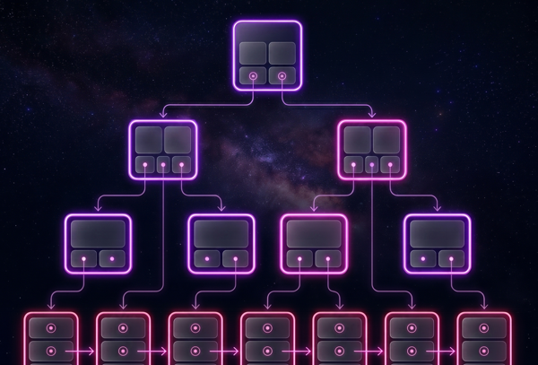

# GlowBox Engine Visualizer

GlowBox Engine Visualizer is an interactive, web-based educational tool designed to visualize complex database engine data structures and indexes. It allows users to watch index structures breathe, split, and collapse in real-time, providing deep insights into how databases manage and organize data under the hood.

 *(Example visualization)*

## 🌟 Key Features

### 1. Data Structure Visualizers
The core feature of the application is its interactive visualizers for various database structures. Rather than just showing the final state, these visualizers focus on the *journey* of the data:
- **B+ Tree**: Visualizes the entire lifecycle of an insertion. You can see the tree traverse down to the correct leaf, watch nodes overflow and split, observe root promotion, and clearly see the horizontal leaf-node chaining that makes range queries efficient.
- **Extendible Hash**: Demonstrates the mechanics of dynamic hashing. It visualizes the global depth directory expanding in real-time, buckets splitting when their local capacity is reached, and the redistribution of binary-hashed keys into new buckets without needing a full table reorganization.
- **R-Tree**: Shows the spatial bounding boxes physically enclosing coordinate points on a 2D plane. As new points are added, you can visually observe how bounding boxes overlap, expand, or split to encompass the new spatial data while minimizing dead space.
- **Inverted Index**: Visualizes the text processing pipeline. It shows documents being broken down into tokens, the mapping of those tokens into posting lists, and how multiple documents are linked to a single indexed term, mimicking the core of modern search engines.
- **Skip List**: Shows the probabilistic multi-layered "express lanes" of the linked list. During a search or insertion, it highlights the traversal path dropping down from the sparse, high-speed upper layers to the dense bottom layer to locate the target.
- **LSM Tree**: Visualizes the tiered storage model. You can watch the in-memory MemTable fill up and eventually flush its sorted runs down to disk-based SSTables. It also visualizes the background compaction process merging these tables together over time.

### 2. Interactive UI & Controls
- **Index Picker**: A sleek menu allowing users to seamlessly switch between different data structures.
- **Mechanism Explorer ("How it Works")**: A modal explaining the technical mechanism behind the currently selected index structure.
- **Annotation System (Notes)**: This acts as the narrative voice of the engine. Rather than just seeing shapes move, the annotation popup provides real-time, human-readable "notes" explaining exactly what is happening at any given micro-step. For instance, when a tree node splits, the note explains *why* (e.g., "Bucket capacity exceeded, splitting and incrementing local depth"), translating abstract algorithmic operations into a coherent, step-by-step visual story.
- **Bottom Controls & Navbar**: Provides granular playback controls for animations and quick navigation.

### 3. Theme & Context Engine
- **Dynamic Theming**: Choose between predefined themes (`Nebula`, `Void`, and `Inferno`) on the landing page, which completely transforms the visualizer's color palette and glowing effects.
- **Immersive Aesthetic**: A highly premium "Cosmic Glowing" visual style featuring deep space backgrounds, glassmorphism, and intense SVG glow effects.

## 🛠️ Tech Stack

- **Frontend Framework**: React 19 + Vite + TypeScript
- **State Management**: Zustand
- **Animations & Rendering**: D3.js (mathematical layouts) & GSAP (high-performance animations)
- **Styling**: Vanilla CSS with CSS Variables (No utility frameworks)

## 🚀 Getting Started

### Prerequisites
Make sure you have Node.js and npm (or yarn/pnpm) installed.

### Installation

1. Clone the repository:
   ```bash
   git clone https://github.com/Seif-Sedky/GlowBox-Engine-Visualizer.git
   ```

2. Navigate into the project directory:
   ```bash
   cd GlowBox-Engine-Visualizer
   ```

3. Install dependencies:
   ```bash
   npm install
   ```

4. Start the development server:
   ```bash
   npm run dev
   ```

5. Open your browser and navigate to `http://localhost:5173/` to see the application in action.

## 🎨 Design Language

GlowBox utilizes a purely custom, **"Cosmic Glowing"** aesthetic. The styling is defined using pure CSS with a robust CSS variable system.
- **Deep Space Backgrounds**: Always-on canvas starfields and dark void palettes (`#05050A`, `#0D0D1A`).
- **Glassmorphism**: Translucent white fills, semi-transparent borders, and heavy backdrop blurring.
- **Typography**: Modern Google Fonts (`Outfit`, `Syne`, `DM Mono`) to elevate the premium, technical feel.

## 👨‍💻 About the Author

GlowBox Engine is created by **Seif Alaa**. It is a passion project born out of a fascination with the sophistication and elegance of database engines.

- **Email**: seif.alaa1231@gmail.com
- **LinkedIn**: [seif Alaa02](https://linkedin.com/in/seif-alaa02)
- **GitHub**: [Seif-Sedky](https://github.com/Seif-Sedky)

---

*Watch your indexes breathe.*
